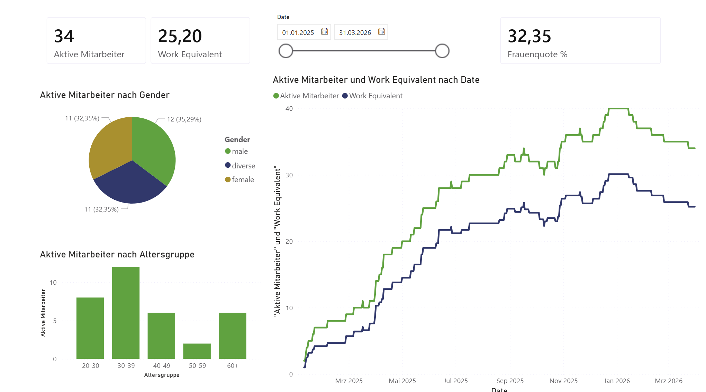
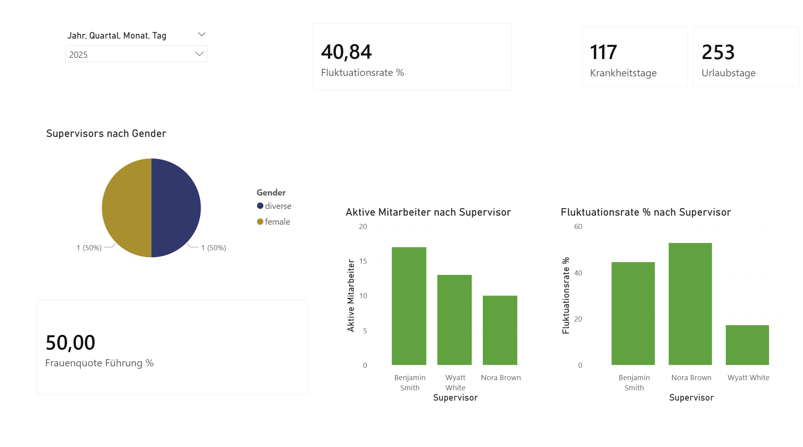
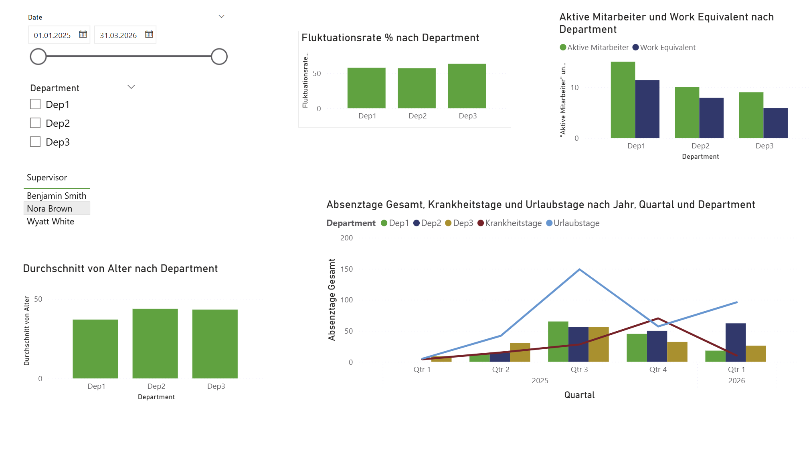
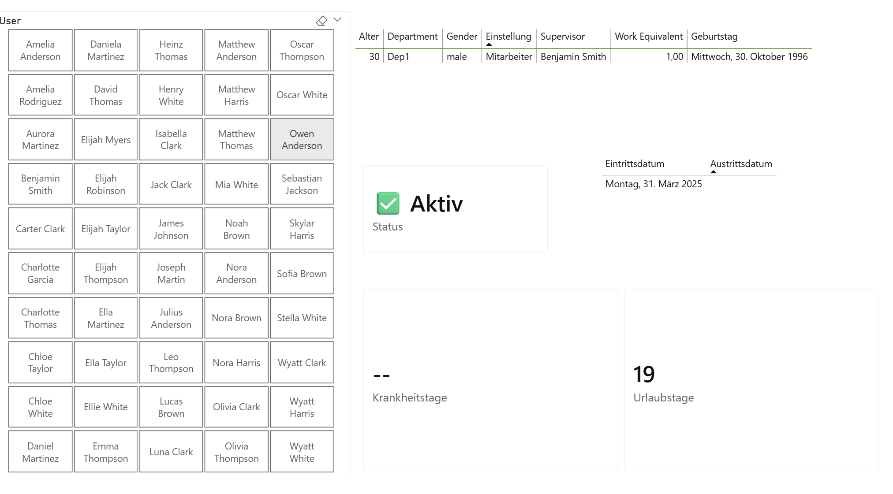

# Employee Analytics Dashboard (Power BI)

This project presents an employee analytics dashboard built with Power BI.

The public version uses simulated HR data and focuses on workforce structure, employee development, and key HR metrics through interactive visualizations.

## 📊 Dashboard Overview

The dashboard provides insights into:

- Employee distribution by gender and age groups  
- Work equivalent trends over time  
- Fluctuation rate (employee turnover)  
- Absence data (sick days and vacation days)  
- Department and supervisor-level analysis  

## 📸 Screenshots

### Overview

### Supervisor Analysis

### Department Analysis

### Employee Detail

## 🧠 Key Insights

- Workforce composition differs across departments  
- Fluctuation rates vary between supervisors  
- Aggregated metrics can hide important patterns  
- Visual dashboards make trends easier to identify than raw data  

## 🗂️ Data

The dataset includes:

- Employee attributes (age, gender, department)  
- Employment periods and status  
- Absence data (sick leave, vacation)  
- Work equivalent values  

Before building the report, I cleaned the sample data, including duplicate and inconsistent employee records.

## ⚙️ Technologies

- Power BI (DAX, Power Query)
- Data modeling & relationships
- Interactive visualizations & slicers

## 🌍 Context

This project was created during my internship at **Arineo GmbH** in Göttingen.

The dashboard structure was later filled with real customer data.

## 💡 Takeaway

Well-structured data combined with clear visualization enables a better understanding of workforce dynamics and decision-making.